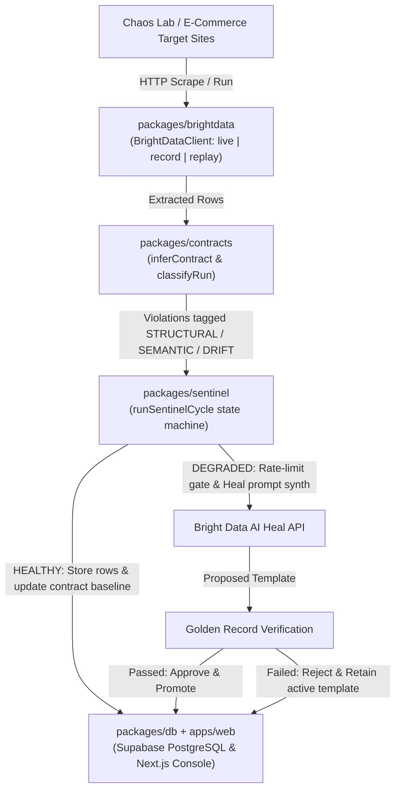
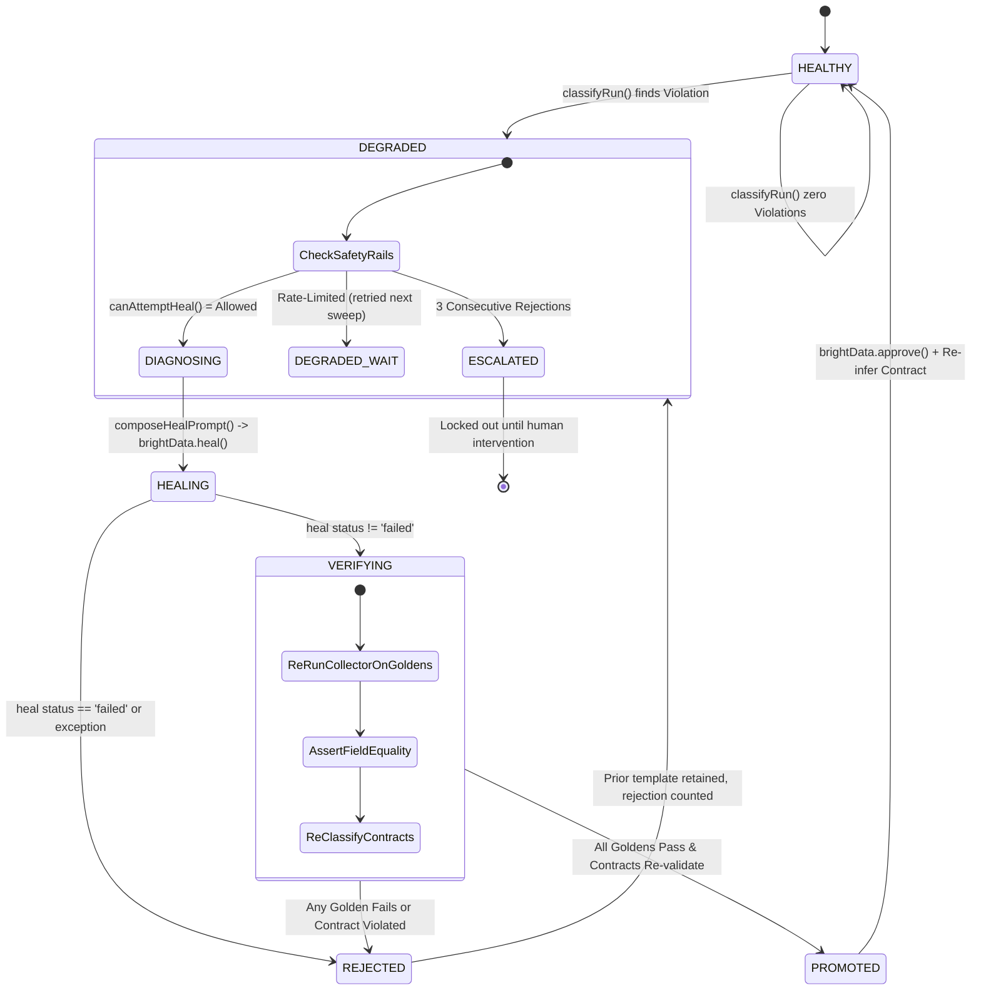
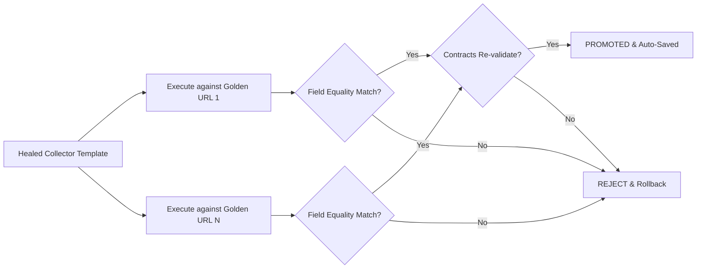

# ScrapeVerse Sentinel

A reliability control plane for web scrapers, built for the Bright Data Scraper Studio hackathon.

## Thesis

Bright Data's `scraper heal` fixes a broken scraper. Sentinel proves the fix is *correct* before it's allowed near real data — turning the CLI's approval gate into a real CI pipeline for scrapers, and catching the failure mode nobody else handles: a scraper that comes back full, but wrong.

Scrapers fail in three classes, and the industry (including Bright Data's own `heal`) only really addresses the first:

1. **Structural** — extraction returns null/empty. Loud, obvious, already solved by `scraper heal`.
2. **Semantic** — extraction returns a value of the wrong type/format/range (currency symbol dropped, price off by 100x, unit changed). Quiet.
3. **Drift** — extraction returns a plausible, correctly-typed value that is *the wrong field* (MSRP instead of sale price, a stale cached price, a competitor's price scraped into the wrong slot). Silent and dangerous — it heals to "looks fine" and stays wrong.

Sentinel implements a closed loop — **contract → detect → diagnose → heal → verify → promote** — over Bright Data collectors, and it **never blind-approves a heal**: every healed template is re-run against human-verified golden records before it's allowed to replace the working one.

## Architecture

```
scrape-verse/
├─ apps/
│  ├─ web/           Next.js 15 App Router — Sentinel console + Shelf-Truth UI
│  └─ chaos-lab/      mutable demo storefront, layout-version switch
├─ packages/
│  ├─ brightdata/     the ONLY module that talks to Bright Data (REST), modes: live | record | replay
│  ├─ contracts/      contract inference + violation engine — pure functions, zero I/O
│  ├─ sentinel/       state machine: detect → diagnose → heal → verify → promote
│  ├─ shelf-truth/    unit-price normalization + shrinkflation detection
│  └─ db/             Supabase schema + typed query layer
└─ docs/
   ├─ superpowers/specs/        design spec + implementation plan
   └─ architecture/             data-flow.md, state-machine.md (this repo's diagrams)
```

Key boundaries:
- `packages/contracts` has no network/DB access — pure, unit- and property-tested.
- `packages/brightdata` is the single seam to Bright Data. Nothing else constructs a request to Bright Data's API directly.
- `packages/sentinel` depends on `contracts` and `brightdata` but owns no scraping logic itself — it's pure orchestration + state transitions, driven through a `SentinelDb` interface (satisfied by a `FakeDb` in tests and by a real Supabase adapter in `apps/web`).

See [docs/architecture/data-flow.md](docs/architecture/data-flow.md) and [docs/architecture/state-machine.md](docs/architecture/state-machine.md) for the diagrams behind this, and [docs/superpowers/specs/2026-08-06-scrapeverse-sentinel-design.md](docs/superpowers/specs/2026-08-06-scrapeverse-sentinel-design.md) / [docs/superpowers/plans/2026-08-06-scrapeverse-sentinel-plan.md](docs/superpowers/plans/2026-08-06-scrapeverse-sentinel-plan.md) for the original design spec and implementation plan.

### Technical Flowcharts

#### 1. System Data Flow Architecture



#### 2. Sentinel State Machine Lifecycle



#### 3. Golden Record Verification Pipeline




## Setup

```bash
pnpm install
cp .env.example .env
# fill in .env — see "Environment variables" below
```

Apply the Supabase schema (Postgres) once you have a Supabase project (`.env.example` only lists `SUPABASE_URL`/`SUPABASE_SERVICE_ROLE_KEY` for the app's own runtime queries — `psql` needs your project's direct Postgres connection string, found in the Supabase dashboard under Project Settings → Database):

```bash
psql -f packages/db/src/schema.sql "<your-supabase-postgres-connection-string>"
```

(`packages/db/src/schema.sql` defines `collectors`, `contracts`, `runs`, `violations`, `heal_attempts`, `goldens`, and `price_observations` — the last of these backs the Shelf-Truth vertical.)

### Environment variables

From `.env.example`:

| Variable | Purpose |
|---|---|
| `BRIGHTDATA_MODE` | `live` \| `record` \| `replay` — see below. **Defaults to `replay` if unset.** |
| `BRIGHTDATA_API_KEY` | Bright Data API key, required for `live`/`record` modes. |
| `BRIGHTDATA_API_BASE` | Bright Data REST base URL (defaults to `https://api.brightdata.com` if unset). |
| `SUPABASE_URL` | Supabase project URL. |
| `SUPABASE_SERVICE_ROLE_KEY` | Supabase service-role key (server-side only). |
| `CHAOS_LAB_ADMIN_URL` | Base URL `apps/web`'s Chaos Lab control page proxies version-switch requests to (defaults to `http://localhost:3001` for local dev — see demo section below). |

**Deployment note:** `createBrightDataClient()` (`packages/brightdata/src/createClient.ts`) falls back to `replay` mode whenever `BRIGHTDATA_MODE` is unset. If you deploy `apps/web` to Vercel without explicitly setting `BRIGHTDATA_MODE=live` in the project's environment variables, the `/api/sweep` cron job (see `apps/web/vercel.json`) will silently run against recorded cassettes instead of live Bright Data infrastructure — it won't error, it just won't touch real collectors. Set `BRIGHTDATA_MODE=live` (and a real `CRON_SECRET`, see below) deliberately before relying on the deployed cron.

## Running tests

```bash
pnpm test
```

Runs the full workspace via `vitest.workspace.ts` (every `packages/*/vitest.config.ts` and `apps/*/vitest.config.ts`) — 24 test files, 75 tests, all in `replay` mode against committed cassettes, no live network calls. `pnpm test:watch` runs the same suite in watch mode. The vitest suite is green across the monorepo. The root `package.json` declares `@types/node` as a devDependency, and `pnpm -r typecheck` passes clean across all 7 projects (`brightdata`, `contracts`, `db`, `sentinel`, `shelf-truth`, `chaos-lab`, `web`).

## Running the Chaos Lab demo

Chaos Lab is a small storefront (`apps/chaos-lab`) with a layout-version switch that engineers each of Sentinel's three failure classes on demand: `v1` (baseline selector), `v2` (structural break — new selector), `v3` (deeper DOM restructure), and `semantic` (currency symbol silently dropped from the price text, same selector still matches).

1. Start Chaos Lab on port 3001 (its API is what `apps/web`'s control page proxies to via `CHAOS_LAB_ADMIN_URL`):
   ```bash
   pnpm --filter chaos-lab dev -- -p 3001
   ```
2. In another terminal, start the Sentinel console:
   ```bash
   pnpm --filter web dev
   ```
3. Visit `http://localhost:3000/chaos-lab` — this is the control panel (`apps/web/app/chaos-lab/page.tsx`) that lets you flip Chaos Lab's layout version (`v1` / `v2` / `v3` / `semantic`) via buttons that POST through `apps/web/app/api/chaos-lab/version/route.ts` to Chaos Lab's own `apps/chaos-lab/app/api/version/route.ts`.
4. Flip the version, then trigger a sweep (or wait for the cron — see below) so Sentinel re-runs the collector, detects the resulting violation, and walks it through diagnose → heal → verify → promote. Watch the result on `http://localhost:3000/collectors/[id]` — the collector detail page renders the field-level contract, the violation log, and the full heal-attempt audit trail (prompt sent, verification result, approve/reject decision). (Raw run history itself is stored in the `runs` table but has no dedicated UI section yet.)

Sentinel cycles are driven by `POST /api/sweep` (`apps/web/app/api/sweep/route.ts`), scheduled every 15 minutes in production via `apps/web/vercel.json`'s cron entry, and requires a `CRON_SECRET` bearer token (the route returns `401` without a matching `Authorization: Bearer <CRON_SECRET>` header) — set `CRON_SECRET` in your environment and call it manually to drive the demo without waiting on the cron.

## `BRIGHTDATA_MODE` modes

Selected by `packages/brightdata/src/createClient.ts`:

| Mode | Behavior |
|---|---|
| `live` | Real calls straight through `LiveBrightDataClient` to Bright Data's REST API. |
| `record` | Same as `live`, wrapped by `CassetteRecorder` — every request/response pair is additionally serialized to `cassettes/<key>.json` for later replay. |
| `replay` (default when unset) | Served entirely from recorded cassettes via `CassetteReplayer`. No network calls, fully deterministic — this is what CI and `pnpm test` run against. |


